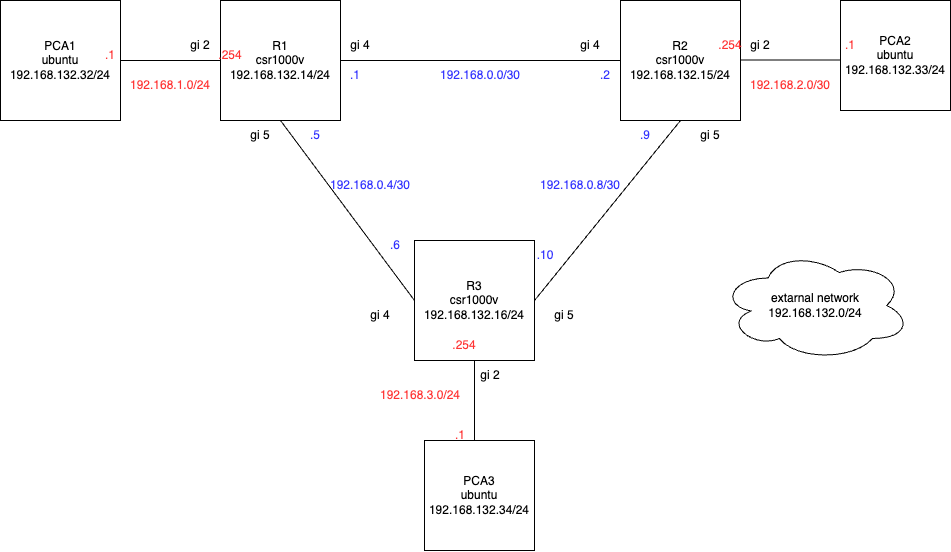

# Containerized NSO

This direcrory contains containerized NSO docker compose.
Before use this, you need to download containerized NSO image from Cisco Web site.
https://software.cisco.com/download/

Follow the instruction to use containerized NSO.
https://developer.cisco.com/docs/nso/guides/containerized-nso/

# Network Configuration
This section provides an overview of the network configuration, including a diagram of the network layout and the necessary login credentials for each device.

When registering devices in NSO, please follow the information provided in the table above.

## Prerequisites for Device Registration in NSO

Before registering devices in NSO, ensure the following prerequisites are met:

1. Each device must be IP reachable.
2. SSH access must be enabled and functional on each device.

These conditions will be automatically fulfilled after the devices are deployed using Terraform.

## Network Diagram

## Device Credentials
| Device Name | IP Address     | User  | Password | Secondary Password |
|-------------|----------------|-------|----------|--------------------|
| R1    | 192.168.23.14     | cisco | cisco  | cisco         |
| R2    | 192.168.23.15     | cisco | cisco  | cisco         |
| R3    | 192.168.23.16     | cisco | cisco  | cisco         |

# NSO service model
This directory contains two NSO sevice-models
## cic-l3
A service model that configures L3 settings for the sample network.
| Parameter                     | Type               | Description                                |
|-------------------------------|--------------------|--------------------------------------------|
| `device1`                      | `leafref`          | Reference to device name (path: `/ncs:devices/ncs:device/ncs:name`) |
| `device2`                      | `leafref`          | Reference to device name (path: `/ncs:devices/ncs:device/ncs:name`) |
| `device3`                      | `leafref`          | Reference to device name (path: `/ncs:devices/ncs:device/ncs:name`) |
| `ipv4-address-loopback-dev1`   | `inet:ipv4-address`| IPv4 Address for Loopback on Device 1      |
| `ipv4-address-loopback-dev2`   | `inet:ipv4-address`| IPv4 Address for Loopback on Device 2      |
| `ipv4-address-loopback-dev3`   | `inet:ipv4-address`| IPv4 Address for Loopback on Device 3      |

ref. [cic-l3.yang](./packages/cic-l3/src/yang/cic-l3.yang)

## cic-bgp
A service model that configures BGP settings for the sample network.
| Parameter        | Type             | Description                        |
|------------------|------------------|------------------------------------|
| `device1`                      | `leafref`          | Reference to device name (path: `/ncs:devices/ncs:device/ncs:name`) |
| `device2`                      | `leafref`          | Reference to device name (path: `/ncs:devices/ncs:device/ncs:name`) |
| `device3`                      | `leafref`          | Reference to device name (path: `/ncs:devices/ncs:device/ncs:name`) |
| `asn-dev1`       | `inet:as-number` | Autonomous System Number for Dev1  |
| `asn-dev2`       | `inet:as-number` | Autonomous System Number for Dev2  |
| `asn-dev3`       | `inet:as-number` | Autonomous System Number for Dev3  |
| `adv-route-dev1` | `inet:ipv4-address` | Advertised IPv4 Route for Dev1    |
| `adv-mask-dev1`  | `inet:ipv4-address` | Advertised IPv4 Mask for Dev1     |
| `adv-route-dev2` | `inet:ipv4-address` | Advertised IPv4 Route for Dev2    |
| `adv-mask-dev2`  | `inet:ipv4-address` | Advertised IPv4 Mask for Dev2     |
| `adv-route-dev3` | `inet:ipv4-address` | Advertised IPv4 Route for Dev3    |
| `adv-mask-dev3`  | `inet:ipv4-address` | Advertised IPv4 Mask for Dev3     |

ref. [cic-bgp.yang](./packages/cic-bgp/src/yang/cic-bgp.yang)
